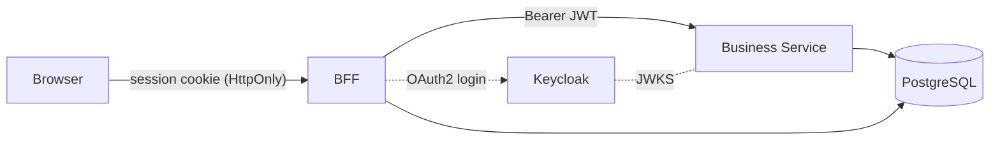

# 🚤 The Boat App

[](https://github.com/sebastien-attia/psychic-lamp/actions/workflows/ci.yml)

A Vue 3 + Spring Boot 4 fullstack reference app built on **strict hexagonal
architecture** with an OWASP-aligned **BFF / resource-server split**, OAuth2 +
Keycloak, contract-first OpenAPI codegen, and Docker + Terraform all the way
to Azure App Service.

End-user instructions live in [`USER_GUIDE.md`](USER_GUIDE.md). The candid AI
retrospective lives in [`AI_USAGE.md`](AI_USAGE.md).

---

## ⚡ Quick start

Spin up the full local-intg stack (frontend + BFF + Business Service + Keycloak
+ PostgreSQL) with one command:

```bash
docker compose up        # or: make up
```

Then open <http://localhost:8080>. 🎉

Prefer to skip the local install? The latest `staging` build is permanently
deployed at:

👉 **<https://boatapp-v2-staging-bff.azurewebsites.net>**

Demo credentials: **`demo`** / **`demo123`**

---

## 🏛️ Architecture

### 🔐 Why a BFF? (OWASP-driven choice)

The split between the browser-facing **BFF** and the **Business Service** is
not an accident — it is the pattern the
[OWASP OAuth2 Cheat Sheet](https://cheatsheetseries.owasp.org/cheatsheets/OAuth2_Cheat_Sheet.html)
recommends as the **most secure way to implement a Single-Page Application**:

> Keep the `access_token` and `refresh_token` server-side, inside an
> HTTP session. The SPA must never see them. It only talks to a
> dedicated back-end — the **Backend-for-Frontend (BFF)** — which holds
> the session and bridges to the downstream business services.

That is exactly what this project does:

- The browser only ever holds an opaque `HttpOnly` **session cookie** — no
  tokens in `localStorage`, no tokens in JS, nothing the SPA can leak.
- The **BFF** (a service created specifically for this purpose) owns the OAuth2
  dance with Keycloak, stores the tokens in its session store, and forwards a
  short-lived `Bearer` JWT to the Business Service on every call.
- The **Business Service** is a stateless OAuth2 resource server that
  validates the JWT and never sees the user's password or refresh token.



#### ⚠️ Why Spring Boot for the BFF — and why it would not be my production choice

The BFF in this project is a **Spring Boot** service. That choice is
deliberate but **pragmatic, not architectural** — I picked it for *this*
codebase, not because it is the right shape of runtime for a BFF in
production.

**Why Spring Boot here:**

- It's a stack I already know well, so I can move fast on the parts of the
  project that actually matter (hexagonal split, OWASP-aligned auth,
  Keycloak integration, CI/CD).
- It deploys as a single self-contained jar / container — same build
  pipeline, same Azure App Service slot pattern as the Business Service.
- It can **serve the SPA's static assets** out of the same process, so the
  whole stack (frontend + BFF + Business Service + Keycloak + Postgres)
  comes up with one `docker compose up`. That kept the early iteration
  loop tight while the rest of the project was being scaffolded.

**Why I would not ship it like this in production:**

- A BFF's job is mostly **edge concerns** — session storage, OAuth2 token
  relay, rate-limiting, header rewriting, request routing — which is
  exactly what a **reactive API gateway** is purpose-built for. A full
  Servlet stack is heavier than the workload warrants.
- Serving static SPA assets from a JVM Web App is wasteful: every byte of
  HTML/JS/CSS goes through the JVM and an Azure App Service compute hop,
  instead of a globally-cached edge node a few milliseconds from the user.

**What I would deploy in production instead:**

- 🌐 **The SPA on a CDN** (Azure Front Door / CloudFront / Cloudflare /
  Azure Static Web Apps). Static assets cached at the edge, near-zero
  latency, free TLS, no compute cost per request.
- 🚪 **[Spring Cloud Gateway](https://spring.io/projects/spring-cloud-gateway)
  as the BFF** — reactive (Netty + Project Reactor), built around the same
  filter/route model an edge proxy actually needs, with first-class
  support for OAuth2 client login and the `TokenRelay` filter, composed
  with Spring Security's session-backed authorized-client store. Same
  Spring ecosystem, dramatically better fit for the job.

The hexagonal contract on the *Business Service* side does not change —
swapping the BFF runtime is, by design, a deployment-topology decision,
not an architectural one.

### 🧩 Pure hexagonal architecture

Both services are organised in **strict hexagonal (ports & adapters)** style.
The goal is twofold:

- **Clarity** — the domain model is decoupled from the framework. Reading the
  code, you can tell business rules from plumbing at a glance.
- **Testability** — pure-Java domain code can be unit-tested without a Spring
  context, while adapters are exercised by integration tests.

| Layer  | BFF (`:8080`) | Business Service (`:8081`) |
|--------|---------------|----------------------------|
| In     | `adapter.in.web` (Spring `@RestController`) | `adapter.in.web` (JWT-validated `@RestController`) |
| Domain | — (thin proxy, no domain) | `domain.{model,exception,service}` — **pure Java**, ArchUnit + Maven enforced |
| Application | — | `application.{port.in,port.out,service}` — **pure Java**, no Spring/Jakarta on the classpath |
| Out    | `adapter.out.client` (Spring HTTP Interface to BS) | `adapter.out.persistence` (Spring Data JPA) |
| Auth   | OAuth2 confidential client, `private_key_jwt` (OIDC Core §9 / RFC 7523) | Stateless JWT resource server |

The Business Service is split into a **four-module Maven reactor** (`domain`,
`application`, `infrastructure`, `bootstrap`). The Maven dependency graph
itself prevents domain or application code from importing Spring or Jakarta —
the import literally would not compile.

One PostgreSQL instance hosts three isolated logical databases with one role
per DB (`bff_session`, `boatapp`, `keycloak`). See [`CLAUDE.md`](CLAUDE.md) for
the full architecture rules.

### 🛡️ ArchUnit guard rails

[ArchUnit](https://www.archunit.org/) tests run on **every Maven build** and
fail the build if anyone breaks the hexagonal rules:

- No `org.springframework.*` / `jakarta.*` imports inside `domain.*` or
  `application.*`.
- `@Service` only in `adapter.in.web`, `@Repository` only in
  `adapter.out.persistence`, `@SpringBootApplication` only at the root.
- Controllers must not be `@Transactional`; persistence must implement
  outbound ports.

Belt-and-braces with the Maven module split — even if someone deleted an
ArchUnit rule, the dependency graph would still reject the import.

### 🔁 Concurrency control: optimistic locking

Multiple users can edit the same boat at the same time. Rather than holding
database row locks across the request, the app uses **optimistic locking** —
writes proceed in parallel, and the second writer is rejected only if the
first has already changed the row. The pattern is consistent end-to-end:

- 🧱 **Domain model** — `Boat` carries a `version` field (`Long`) that is
  bumped on every persisted update.
- 💾 **Persistence (JPA)** — the `BoatJpaEntity` is annotated with
  `@Version`, so Hibernate emits `UPDATE … WHERE id = ? AND version = ?`
  and translates a zero-row result into Spring's
  `OptimisticLockingFailureException`.
- 🌐 **HTTP contract** — read responses (`GET`, `POST`) carry an `ETag`
  header containing the current version. Every `PUT` **must** echo it back
  in the `If-Match` header (parsed as a bare integer per
  `contracts/openapi.yaml`).
- 🚦 **Error mapping** (RFC 9457 ProblemDetail, see
  [`.claude/rules/validation-and-errors.md`](.claude/rules/validation-and-errors.md)):
  - `409 Conflict` (`type: …/concurrency-conflict`) — `If-Match` was sent
    but the version is stale (someone else won the race). Both the domain
    `ConcurrentModificationException` (raised by the application service
    when it notices a stale version *before* writing) and JPA's
    `OptimisticLockException` (raised by Hibernate at flush time) map to
    this single response shape.
  - `428 Precondition Required` (`type: …/precondition-required`) —
    `If-Match` was missing entirely. Forces clients to participate in the
    contract instead of silently last-write-wins.
- 🖥️ **Frontend UX** — a 409 surfaces as a toast with a **Refresh** action
  that re-fetches the current state and re-arms the form, so the user can
  re-apply their edit on top of the latest version. An E2E Playwright test
  exercises this conflict path end-to-end.

---

## 🌱 Environments

The project ships with **four distinct environments**, each tuned for a
different stage of the development loop. The aim is to **maximise iteration
speed** at every stage:

| Profile         | What runs locally                                             | Auth              | When to use it                                                      |
|-----------------|---------------------------------------------------------------|-------------------|---------------------------------------------------------------------|
| 🟢 `dev`        | Business Service + Frontend + PostgreSQL only                 | **Bypassed** (dummy user auto-created) | Iterate on frontend pages without booting Keycloak — fastest loop. |
| 🟡 `local-intg` | Frontend + BFF + Business Service + Keycloak + PostgreSQL     | Real session + JWT, real Keycloak | Full integration on your laptop, with **real inter-service communication**. |
| 🟠 `staging`    | Deployed to Azure                                             | Real session + JWT | **Auto-deployed on every merge to the `staging` branch.**          |
| 🔴 `production` | Deployed to Azure                                             | Real session + JWT | **Only deployed on a versioned Release**, plus a **manual** approval step. |

```bash
# 🟢 dev — fast frontend iteration (no Keycloak, no BFF)
make dev                          # postgres + business-service-dev
cd frontend && npm run dev        # Vite proxies /api → :8081
# → http://localhost:5173

# 🟡 local-intg — full stack, real auth
make up                           # or: docker compose up
# → http://localhost:8080
# Keycloak admin: http://localhost:8180
```

The BFF needs an RSA signing key for `private_key_jwt` to Keycloak; the
`bff-keygen` init service in `docker-compose.yml` generates it on first boot
(idempotent — skipped on every subsequent run). For the IDE-run BFF case
(Maven directly, no compose), use
`./ai-scripts/00b-generate-bff-key.sh OUT=./bff/src/main/resources/keys`.

`make help` lists every Makefile target.

---

## 🧪 Testing strategy

Each layer of the hexagonal architecture is exercised by the test type that
fits it best:

| Test type                | What it covers                                                                                  | Tools                                       |
|--------------------------|-------------------------------------------------------------------------------------------------|---------------------------------------------|
| 🧱 **Unit tests**         | Pure-Java `domain.*` and `application.*` — validators, use-case services. No Spring context.    | JUnit 5, AssertJ                            |
| 🔌 **Integration tests**  | Adapters: persistence (real PostgreSQL via Testcontainers), web (`@WebMvcTest` + `jwt()` post-processor), BFF↔Keycloak (real Keycloak container). | Spring Boot Test, Testcontainers, WireMock |
| 🌐 **End-to-End tests**   | Full browser → BFF → Business Service flow: login, list / search / pagination, CRUD, optimistic-locking conflict, axe-core accessibility. | Playwright                                  |
| 🛡️ **ArchUnit tests**     | Hexagonal boundaries enforced on every build (see above).                                       | ArchUnit                                    |

```bash
make test         # both Maven suites: ArchUnit + Testcontainers + WireMock
make e2e          # Playwright against the running local-intg stack
```

---

## 🔒 Supply-chain security

Three independent tool categories cover our build and CI pipeline. Each
answers a different question about the code we ship — together they cover
**our** code, **everyone else's** code, and **what we actually shipped**.

| Category | What it does | Tools used here |
|----------|--------------|-----------------|
| 🐛 **SAST** — *Static Application Security Testing* | Analyses **our own code** statically — no execution — for known-bad patterns: SQL injection, hard-coded credentials, weak crypto, unsafe deserialization, … The Maven build fails on findings in the `SECURITY` category. | `spotbugs-maven-plugin` + `findsecbugs-plugin` (bytecode, on every `mvn verify`); **CodeQL** (source, on `main`/`staging` + weekly cron via `codeql.yml`) |
| 🧬 **SCA** — *Software Composition Analysis* | Cross-references every **third-party** dependency (direct + transitive) against a public vulnerability database, so we know within hours when a new CVE hits a library we already use. CI fails on `HIGH` + `CRITICAL`. | `osv-scanner` against [OSV](https://osv.dev/) (`google/osv-scanner-action` in CI; opt-in `./mvnw -Posv verify` locally) |
| 📋 **SBOM** — *Software Bill of Materials* | Produces the **inventory** of the artifact we just built — every component, version, and license — in the standard CycloneDX format. The SBOM is what lets us answer *"are we exposed to CVE-XYZ?"* tomorrow without rebuilding or rescanning yesterday's release. | `cyclonedx-maven-plugin` (emits `target/bom.json` + `target/bom.xml` on `mvn package`); uploaded to **Dependency-Track** on staging + prod deploys for continuous CVE monitoring |

Two complementary scans run alongside these in CI: **gitleaks** for committed
secrets, and **Trivy** for vulnerabilities inside the final container images.

```bash
./mvnw verify                # SAST + SBOM (always on)
./mvnw -Posv verify          # + SCA (requires the osv-scanner binary)
```

---

## 🛠️ Tech stack

The stack deliberately tracks the **latest LTS / stable** versions, to learn
the new platform features and stay ahead of the upgrade curve:

| Component             | Version | Why                                |
|-----------------------|---------|------------------------------------|
| ☕ **Java**            | **25**  | Latest LTS                         |
| 🌱 **Spring Boot**    | **4.0.6** | Latest stable                    |
| 📦 **Maven**          | wrapper (`./mvnw`) | Reproducible builds      |
| springdoc-openapi     | 2.8.13  | OpenAPI 3 + Swagger UI             |
| ArchUnit              | 1.4.1   | Hexagonal enforcement              |
| OpenAPI generator     | 7.11.0  | Contract-first codegen             |
| Vue                   | 3.5.32  | SPA framework                      |
| Vite                  | 8.0.10  | Frontend build tool                |
| Pinia                 | 3.0.4   | State management                   |
| TypeScript            | 6.0.2   | Type safety                        |
| Tailwind CSS          | 3.4.19  | Styling                            |
| Playwright            | 1.59.1  | E2E browser tests                  |
| PostgreSQL            | `postgres:17-alpine` | Persistence              |
| Keycloak              | `quay.io/keycloak/keycloak:26.6.1` | Identity Provider |
| keycloak-config-cli   | `latest-26.5.4` | Realm-as-code             |

### Prerequisites

- 🐳 Docker ≥ 24
- 🧱 Docker Compose ≥ v2.20 (the `docker compose` plugin, not `docker-compose`)
- 🌿 Git ≥ 2.40

Java and Node are **not** required on the host — every build runs inside
Docker. Install them only if you want to use the IDE-friendly Maven / Vite
workflows.

---

## 📖 API documentation

Swagger UI is auto-served by `springdoc-openapi` at:

- BFF: <http://localhost:8080/swagger-ui.html>
- Business Service: <http://localhost:8081/swagger-ui.html>

The OpenAPI 3.0 contract at [`contracts/openapi.yaml`](contracts/openapi.yaml)
is the single source of truth — both the BFF's HTTP-Interface client and the
frontend's typed Axios client are generated from it.

---

## 🚀 Deploy

For an end-to-end runbook (fresh Microsoft account → green CI →
auto-staging → manual production), see [`DEPLOYMENT.md`](DEPLOYMENT.md).
Plain-English definitions of every Azure and GitHub concept used live
in [`CONCEPTS.md`](CONCEPTS.md).

| Tool             | Role |
|------------------|------|
| 🏗️ Terraform     | Provisions Azure infra in **Switzerland North**: Flexible PostgreSQL v17 (public + AllowAllAzure firewall), ACR, Linux App Service Plan + 3 Linux Web Apps (BFF, business-service, Keycloak — all public over HTTPS), Key Vault. The `db-bootstrap` module runs psql via `local-exec` to create the per-DB roles during apply. |
| 🔑 Keycloak realm | Applied at deploy time by running `adorsys/keycloak-config-cli` as a one-shot docker container against the Keycloak Web App — idempotent create-or-update against the admin API. |
| 🤖 GitHub Actions | `ci.yml` (lint / build / SCA / secret-scan / container-scan / E2E), `codeql.yml` (SAST on main+staging + weekly cron), `deploy-staging.yml` (auto on push to `staging`), `deploy-production.yml` (fires on `release: published`, gated by Required Reviewer — OIDC federation, zero long-lived secrets). |

---

## 🔑 Other key design decisions

- **Confidential client with `private_key_jwt`** (RFC 7523): no client secret
  to leak — Keycloak fetches the BFF's public JWKS over the network.
- **RFC 9457 ProblemDetail** is the single error envelope (status, type,
  title, instance, plus `messages[]` for validation). See
  [`.claude/rules/validation-and-errors.md`](.claude/rules/validation-and-errors.md).
- **Optimistic locking** with `@Version` + `ETag` / `If-Match` — see
  [Concurrency control](#-concurrency-control-optimistic-locking) above.
- **Liquibase per service**: BFF owns `SPRING_SESSION`, Business Service owns
  `APP_USER` / `BOATS` / `BOAT_AUDIT`, Keycloak manages its own schema.

---

## 📁 Project layout

`bff/` (proxy + OAuth2 client) · `business-service/` (resource server, domain
logic) · `frontend/` (Vue 3 SPA) · `contracts/` (`openapi.yaml` + codegen) ·
`infra/` (`docker/`, `keycloak/`, `postgres/`, `terraform/`) ·
`ai-scripts/` (per-phase prompts + check suites) · `.claude/` (rules, hooks,
code-reviewer subagent) · `.github/workflows/`.

---

## 📜 License

Released under the [GNU Affero General Public License v3.0](LICENSE).
