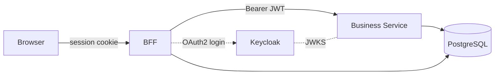

# The Boat App

[](https://github.com/sebastien-attia/psychic-lamp/actions/workflows/ci.yml)

A Vue 3 + Spring Boot 4 fullstack reference app built on **strict hexagonal
architecture** with a BFF / resource-server split, OAuth2 + Keycloak,
contract-first OpenAPI codegen, and Docker / Terraform / Ansible all the way to
Azure Container Apps.

End-user instructions live in [`USER_GUIDE.md`](USER_GUIDE.md). The candid AI
retrospective lives in [`AI_USAGE.md`](AI_USAGE.md).

## Architecture



| Layer  | BFF (`:8080`) | Business Service (`:8081`) |
|--------|---------------|----------------------------|
| In     | `adapter.in.web` (Spring `@RestController`) | `adapter.in.web` (JWT-validated `@RestController`) |
| Domain | — (thin proxy, no domain) | `domain.{model,port,service}` — **pure Java**, ArchUnit-enforced |
| Out    | `adapter.out.client` (Spring HTTP Interface to BS) | `adapter.out.persistence` (Spring Data JPA) |
| Auth   | OAuth2 confidential client, `private_key_jwt` (OIDC Core §9 / RFC 7523) | Stateless JWT resource server |

One PostgreSQL instance hosts three isolated logical databases with one role
per DB (`bff_session`, `boatapp`, `keycloak`). See [`CLAUDE.md`](CLAUDE.md) for
the full architecture rules.

## Tech stack

| Component             | Version |
|-----------------------|---------|
| Java                  | 25 |
| Spring Boot           | 4.0.6 |
| springdoc-openapi     | 2.8.13 |
| ArchUnit              | 1.4.1 |
| OpenAPI generator     | 7.11.0 |
| Vue                   | 3.5.32 |
| Vite                  | 8.0.10 |
| Pinia                 | 3.0.4 |
| TypeScript            | 6.0.2 |
| Tailwind CSS          | 3.4.19 |
| Playwright            | 1.59.1 |
| PostgreSQL            | `postgres:17-alpine` |
| Keycloak              | `quay.io/keycloak/keycloak:26.6.1` |
| keycloak-config-cli   | `latest-26.5.4` |

## Prerequisites

- Docker ≥ 24
- Docker Compose ≥ v2.20 (the `docker compose` plugin, not `docker-compose`)
- Git ≥ 2.40

Java and Node are **not** required on the host — every build runs inside
Docker. Install them only if you want to use the IDE-friendly Maven / Vite
workflows.

## Setup

### Full local-intg stack (BFF + Keycloak + Business Service + Postgres)

```bash
./ai-scripts/00b-generate-bff-key.sh   # one-off: writes infra/docker/keys/bff-signing-key.pem
make up                                 # or: docker compose up
```

App: <http://localhost:8080> · Keycloak admin: <http://localhost:8180>

### Dev mode (no Keycloak, no BFF, auth bypassed)

```bash
make dev                                # postgres + business-service-dev
cd frontend && npm run dev              # Vite proxies /api → :8081
```

App: <http://localhost:5173>

`make help` lists every Makefile target.

## Test

```bash
make test         # both Maven suites: ArchUnit + Testcontainers + WireMock
make e2e          # Playwright against the running local-intg stack
```

- **ArchUnit** (both modules): no `org.springframework.*` / `jakarta.*` in
  `domain.*`; controllers don't `@Transactional`; persistence implements
  outbound ports.
- **Testcontainers** spins up a real PostgreSQL per test class; BFF tests also
  spin up a real Keycloak. JWT-protected Business Service tests use Spring
  Security's `jwt()` request post-processor — no Keycloak required.
- **Playwright** drives a real browser through the BFF login flow; suites
  cover auth, list/search/pagination, CRUD, optimistic-locking conflict, and
  axe-core accessibility.

## API documentation

Swagger UI is auto-served by `springdoc-openapi` at:

- BFF: <http://localhost:8080/swagger-ui.html>
- Business Service: <http://localhost:8081/swagger-ui.html>

The OpenAPI 3.0 contract at [`contracts/openapi.yaml`](contracts/openapi.yaml)
is the single source of truth — both the BFF's HTTP-Interface client and the
frontend's typed Axios client are generated from it.

## Deploy

| Tool             | Role |
|------------------|------|
| Terraform        | Provisions Azure infra in **Switzerland North**: VNet + private DNS, Flexible PostgreSQL v17, ACR, Container Apps (BFF external, BS internal, Keycloak external), Key Vault. |
| Ansible          | Bootstraps per-DB roles over the private endpoint, injects secrets from Key Vault into Container App env, runs Liquibase migration jobs, configures the Keycloak realm with `keycloak-config-cli`. |
| GitHub Actions   | `ci.yml` (lint / build / SCA / Docker / E2E), `deploy-staging.yml` (auto on push to `staging`), `deploy-production.yml` (manual via Release, OIDC federation — zero long-lived secrets). |

## Key design decisions

- **Hexagonal**: `domain.*` is plain Java, ArchUnit fails the build on any
  Spring/Jakarta import. Adapters live in `adapter.in.*` and `adapter.out.*`.
- **BFF / resource-server split**: the browser only ever holds a `HttpOnly`
  session cookie; the JWT bearer never leaves the cluster. BFF refreshes the
  token via Spring's `OAuth2AuthorizedClientManager`.
- **Confidential client with `private_key_jwt`** (RFC 7523): no client secret
  to leak — Keycloak fetches the BFF's public JWKS over the network.
- **RFC 9457 ProblemDetail** is the single error envelope (status, type,
  title, instance, plus `messages[]` for validation). See
  [`.claude/rules/validation-and-errors.md`](.claude/rules/validation-and-errors.md).
- **Optimistic locking** with `If-Match` / `ETag` on every `PUT`; conflicts
  surface to the UI as a toast with a Refresh action.
- **Liquibase per service**: BFF owns `SPRING_SESSION`, Business Service owns
  `APP_USER` / `BOATS` / `BOAT_AUDIT`, Keycloak manages its own schema.

## Project layout

`bff/` (proxy + OAuth2 client) · `business-service/` (resource server, domain
logic) · `frontend/` (Vue 3 SPA) · `contracts/` (`openapi.yaml` + codegen) ·
`infra/` (`docker/`, `keycloak/`, `postgres/`, `terraform/`, `ansible/`) ·
`ai-scripts/` (per-phase prompts + check suites) · `.claude/` (rules, hooks,
code-reviewer subagent) · `.github/workflows/`.

## License

Released under the [GNU Affero General Public License v3.0](LICENSE).
